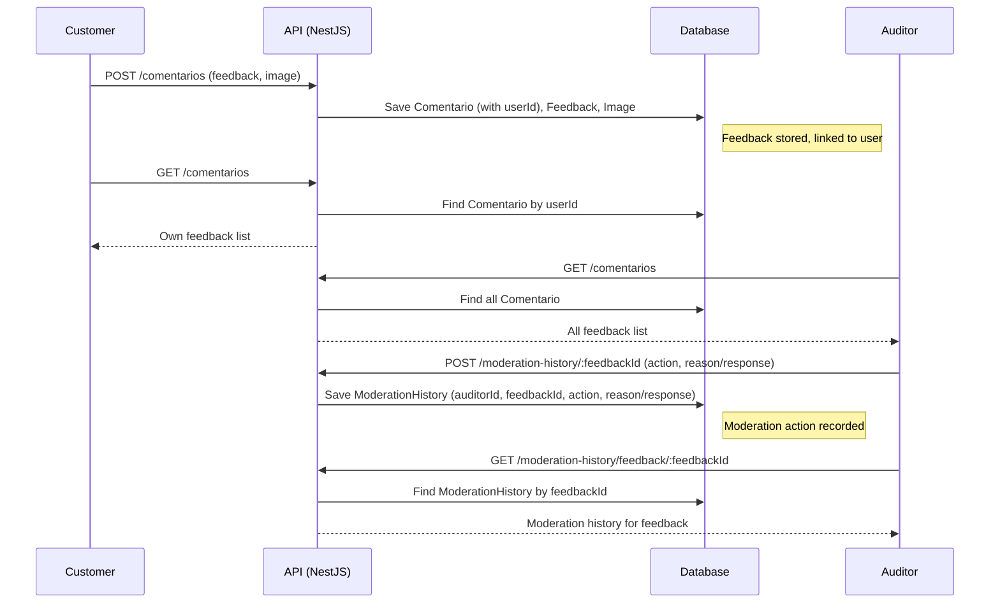

# API: Análisis de sentimientos, Supermercado Amigos

## Roadmap de features
- [x] Configuración de bases de datos
- [x] Autenticación de usuarios
- [x] Registro de usuarios
- [ ] Modelado de datos y entidades
- [ ] Roles y permisos
- [ ] Subida de archivos (integracion con Google Cloud Storage)
- [ ] Análisis de sentimientos, integracion con Google Vision API
- [ ] Generación de reportes

- [ ] Testing y validación de la API

## 📊 Report Feature Usage

The API provides endpoints to generate feedback reports filtered by product, store, and date range.

### Endpoints

- **GET /reports/raw?store=STORE_ID&type=PRODUCT_TYPE&from=YYYY-MM-DD&to=YYYY-MM-DD**
  - Returns a structured JSON report with summary metrics and detailed feedback entries.

- **GET /reports/pdf?store=STORE_ID&type=PRODUCT_TYPE&from=YYYY-MM-DD&to=YYYY-MM-DD**
  - Returns a downloadable PDF report with the same data, formatted for printing/sharing.

### Query Parameters
- `store` (number, optional): Store (branch) ID to filter by
- `type` (string, optional): Product type/name to filter by (partial match)
- `from` (string, optional): Start date (inclusive, format: YYYY-MM-DD)
- `to` (string, optional): End date (inclusive, format: YYYY-MM-DD)

### Example Requests

**Raw JSON report:**
```
GET /reports/raw?store=1&type=banana&from=2024-06-01&to=2024-06-30
```

**PDF report:**
```
GET /reports/pdf?store=1&type=banana&from=2024-06-01&to=2024-06-30
```

### Report Data Includes
- Report metadata (store, product type, date range, generated timestamp)
- Summary metrics (total feedback, count by emotion, top 3 image issues)
- Detailed entry table: Timestamp, Product, Store, Feedback, Emotion, Issues

---

## 🛒 Supermarket Feedback System: Information Flow

### 1. Customer Submits Feedback
- **Who:** Authenticated user with role `cliente` (Customer).
- **How:**
  - Submits a feedback comment (optionally with an image) via the `/comentarios` endpoint.
  - The system hashes and stores the feedback, associates it with the customer (`userId`), and links any uploaded image.
  - The feedback is stored in the `Comentario` entity, and a `Feedback` record is created to link the comment and image.

### 2. Feedback Storage
- **Entities Involved:**
  - `Comentario`: Stores the comment, sentiment, product/store, and the `userId` of the customer.
  - `Feedback`: Links the comment and image, and is the main entity for moderation.
  - `Image` (optional): Stores the uploaded image.
- **Access Control:**
  - Only the customer who created the feedback can view or delete their own feedback.
  - Managers and auditors can view all feedback.

### 3. Feedback Visibility
- **Customers:**
  - Can only see and manage (delete) their own feedback.
- **Auditors & Managers:**
  - Can view all feedback entries in the system.

### 4. Moderation by Auditors
- **Who:** Authenticated user with role `auditor`.
- **How:**
  - Auditors access the `/moderation-history` endpoints.
  - They can see all feedback entries and their moderation history.
  - For each feedback, an auditor can:
    - Approve
    - Reject (with a reason)
    - Answer (with a response)
  - Each moderation action creates a `ModerationHistory` record, storing:
    - The auditor (`auditorId`)
    - The feedback (`feedbackId`)
    - The action taken (`approved`, `rejected`, `answered`)
    - The reason/response (if provided)
    - The timestamp

### 5. Moderation History Storage
- **Entity:**
  - `ModerationHistory`: Stores all moderation actions, linked to both the auditor and the feedback.
- **Access Control:**
  - Only auditors can create moderation records.
  - Auditors can view all moderation history.

### 6. Manager Role
- **Managers** can view and delete any feedback, but cannot submit feedback or moderate (unless you extend their permissions).

---

### High-Level Flow Diagram



---

### Roles & Permissions Table

| Role      | Can Submit Feedback | Can View Own | Can View All | Can Moderate | Can Delete Own | Can Delete Any |
|-----------|--------------------|--------------|--------------|--------------|---------------|---------------|
| Customer  | ✅                 | ✅           | ❌           | ❌           | ✅            | ❌            |
| Auditor   | ❌                 | ❌           | ✅           | ✅           | ❌            | ❌            |
| Manager   | ❌                 | ❌           | ✅           | ❌           | ❌            | ✅            |

---
